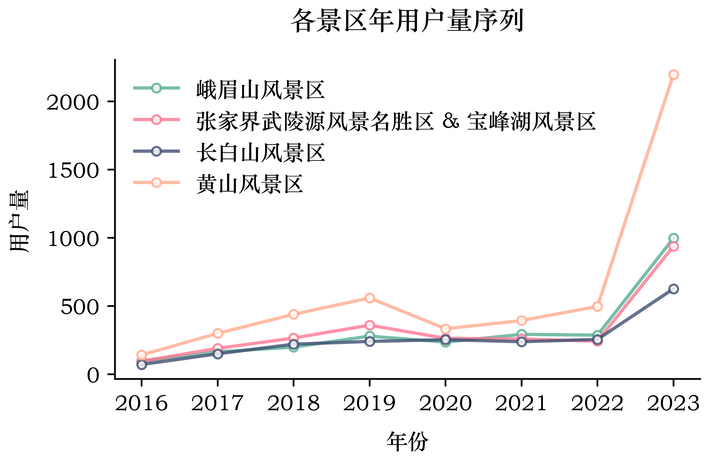
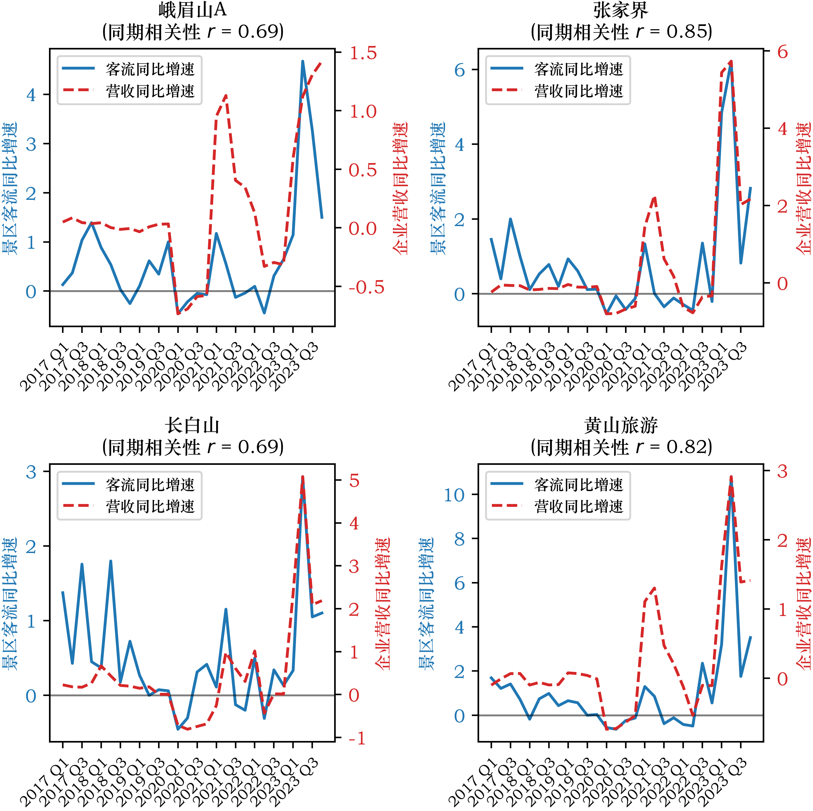
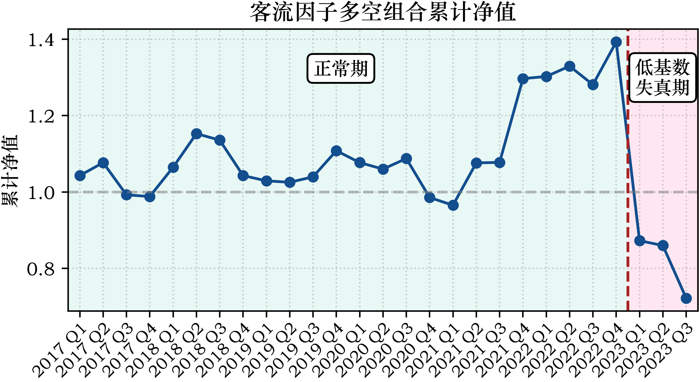

# GPS轨迹另类数据因子：A股旅游板块客流信号的构建与回测
# Alternative Data Factor from GPS Trajectories: Foot Traffic Signal Construction and Backtesting in the A-Share Tourism Sector
---
## 关键词
另类数据 (Alternative data)；GPS轨迹 (GPS trajectory)；客流因子 (Foot traffic factor)；实时预测 (Nowcasting)；旅游板块 (Tourism sector)；多空组合 (Long-Short portfolio)


## 研究背景

**营收**是评估景区类上市公司**基本面**的核心指标，但季度财报的披露通常**滞后季度末1–4个月**，投资者在此窗口期内只能依赖历史数据和分析师预测，难以及时掌握当季经营状况。

**另类数据**提供了一种可能的解决路径。如果某类实时数据能够在财报披露之前准确反映景区的客流状况，便可以填补这段信息空白。**卫星图像、信用卡交易**等另类数据已在海外市场得到广泛验证，而**户外运动平台GPS轨迹数据**尚无公开的研究结果。这类数据记录了用户的真实到访行为，与景区客流在逻辑上高度吻合，但其实际预测能力如何，目前没有公开的研究结论。

本项目以此为出发点，尝试回答两个问题：**（1）户外平台的GPS轨迹数据能否作为景区客流的可靠代理指标？（2）由此构建的客流因子，能否对景区类上市公司的季度营收方向形成有效预测？**

---

## 数据来源

| 数据 | 来源 | 描述 |
|--------|------|------|
| GPS轨迹 | 某户外活动平台 | 2016–2023年
| 景区边界 (AOI) | 百度地图 | 研究对象相关的景区
| 季度营收 | 财报利润表，从[AKShare](https://github.com/akfamily/akshare)获取 | A股景区类上市公司
| 股价 (前复权) | [AKShare](https://github.com/akfamily/akshare) | A股景区类上市公司

> **注：** 原始轨迹数据因隐私协议不予公开。`data` 目录下提供少量脱敏样本数据供代码复现使用。



---

## 研究对象

| 景区 | 上市公司 | 股票代码 |
|------|---------|---------|
| 黄山风景区 | 黄山旅游 | 600054 |
| 峨眉山风景区 | 峨眉山A | 000888 |
| 张家界武陵源风景名胜区 & 宝峰湖风景区 | 张家界 | 000430 |
| 长白山风景区 | 长白山 | 603099 |

选择标准：营收高度依赖单一景区、景区徒步属性强、与户外平台用户画像高度吻合。

---

## 研究方法

### 1. 构建各景区的季度客流序列

- 轨迹数据清洗：过滤异常轨迹，并找出与景区边界相交的轨迹（29228条）
- 提取落入景区边界范围内的轨迹点
- 按季度统计各景区访客量（同一用户季度内去重）
- 对季度访客量计算同比增速（Year-over-Year, YoY），以消除季节性效应

### 2. 季度客流同比增速与营收同比增速的相关性分析（Nowcasting验证）

- 对客流同比增速与季度营收同比增速做Pearson相关检验
- 分别检验同期相关（R0）、领先1期（R1）、领先2期（R2）

### 3. 因子构建与多空组合

- 每季度末按客流同比增速对四只股票截面排序
- 多头组（排名1–2）做多，空头组（排名3–4）做空
- 持有下一季度，计算多空收益差，累计净值曲线评估因子有效性

---

## 核心结论

### 1. 景区客流同比增速与企业季度营收同比增速的相关性

- 四个景区客流与营收同比增速均呈**中高水平的正相关 (r = 0.69 – 0.85, p < 0.001)**。由于轨迹数据在季度末即可获得，较财报披露早1 – 4个月，该信号具备信息领先优势。

- 领先相关性检验显示同期相关最强，表明该信号的价值在于**Nowcasting当季营收方向**，而非预测下一季度。

    

    | 景区 | 同期 (R0) | 领先1期 (R1) | 领先2期 (R2) | P值 (同期) |
    | --- | --- | --- | --- | --- |
    | 峨眉山A | 0.69 | 0.65 | 0.47 | <0.001 |
    | 张家界 | 0.85 | 0.49 | 0.28 | <0.001 |
    | 长白山 | 0.69 | 0.25 | 0.24 | <0.001 |
    | 黄山旅游 | 0.82 | 0.50 | 0.42 | <0.001 |


### 2. 因子回测表现
  

- 正常期内，策略累计多空收益39.27%，CAGR 5.68%，胜率54.17%，验证了客流因子在旅游板块的截面区分能力。
- 2023Q1起，策略快速回撤，原因分析：
  - 原因1（因子层面）：2022年疫情管控导致各景区客流接近归零，2023年同比基期极低，四只股票客流增速同步虚高，截面排序丧失区分意义。
  - 原因2（市场层面）：即便客流与营收的同比相关性在2023年依然显著，股价亦未能跟随，因为市场已于2022年底提前定价复苏预期，基本面兑现时形成"利好出尽"效应。

    

    | 时期 | 胜率 | 平均季度多空收益差 | 累计多空收益 | CAGR | 最大回撤 | 卡玛比率 | 夏普比率 |
    |------|------|-----------------|------------|------|---------|---------|---------|
    | 2017Q1–2022Q3（正常期） | 54.17% | +1.59% | +39.27% | 5.68% | -16.25% | 0.35 | 0.48 |
    | 2017Q1–2023Q4（完整期） | 48.15% | -0.61% | -27.78% | -4.71% | -48.15% | -0.10 | -0.12 |

    > **注：** 夏普比率与卡玛比率基于季度频率数据计算，样本量有限，仅供参考。

---

## 局限性与反思

- **低基数失真（2022–2023）：** 疫情管控期间各景区客流接近归零，导致2023年同比增速普遍虚高（部分景区超1000%），四只股票的客流增速同步抬升，截面排序丧失区分意义，因子在此阶段失效。这暴露出单纯依赖同比增速作为因子时，在宏观层面发生极端低基数切换时的脆弱性。
  - **后续优化方向**：在同比增速之外，引入相对2019年的绝对恢复度作为交叉验证指标，以识别同比虚高但尚未真正恢复的状态，提升因子在极端宏观环境下的稳健性。
- **样本规模：** 仅四家上市公司，组合层面的统计结论应审慎解读。
- **平台用户增长噪音：** 户外平台在2016–2019年处于快速扩张期，用户量的增长会混入客流信号，掩盖真实的景区访客变化。
- **用户代表性：** 户外平台用户偏向徒步爱好者，对普通观光游客的覆盖存在系统性偏差。

---

## 目录结构

```
tourism-flow-factor/
├── data/                           # 脱敏样本数据
├── codes/
│   ├── config.py                   # 全局配置中心
│   ├── 01_Data_Preparation.ipynb   # API获取数据及坐标转换
│   ├── 02_Trajectory_Extraction.py # 并发提取特征、打通判断逻辑流水线
│   ├── 03_Merge_and_Deduplicate.py # 合并将 UV 等数据归约去重
│   └── 04_Financial_Analysis.ipynb # 串联流量到财报的相关性图形展示论证
├── figures/                        # 图表
└── README.md
```

---

## 依赖环境

```
pandas
numpy
scipy
statsmodels
matplotlib
seaborn
akshare
geopandas
```

## 作者与联系方式
* **姓名:** 罗佩弦
* **Email:** lpx4281@gmail.com
* **兴趣:** 空间数据挖掘、另类数据分析与量化策略研究

## 引用声明
如果您在学术论文、研究报告或商业分析中使用了本项目的思路、代码或结论，请引用本仓库：

Peixian Luo. (2026). *Alternative Data Factor from GPS Trajectories: Foot Traffic Signal Construction and Backtesting in the A-Share Tourism Sector*. GitHub. https://github.com/luopx/tourism-flow-factor

## 免责声明
本项目提供的所有内容（包括但不限于数据分析、策略回测、代码与图表）仅供学术研究和技术交流使用，不构成任何投资建议或财务参考。基于历史数据构建的因子与回测收益不代表未来真实市场的表现。作者不对任何人因使用本项目内容而导致的任何直接或间接投资损失负责。市场有风险，投资需谨慎。